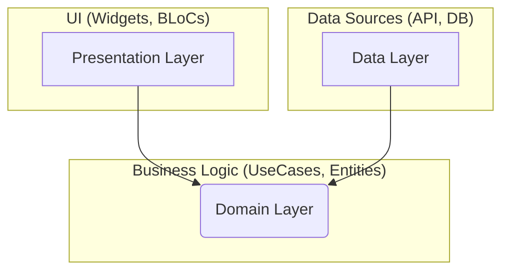

# Architecture Overview

This document provides a detailed overview of the Clean Architecture implementation in the Eshara project. Understanding these concepts is crucial for contributing to the codebase effectively.

## Guiding Principles

Our architecture is built upon the principles of **Clean Architecture**. The primary goal is the **separation of concerns**, which we achieve by dividing the application into three main layers:

1.  **Presentation (UI) Layer**: Responsible for everything the user sees and interacts with.
2.  **Domain Layer**: The core of the application, containing the business logic.
3.  **Data Layer**: Responsible for fetching data from various sources (network, local database, etc.).

The key rule is the **Dependency Rule**: Source code dependencies can only point inwards. Nothing in an inner layer can know anything at all about an outer layer.

## Layer Breakdown

### 1. Domain Layer

- **Location**: `lib/features/<feature_name>/Domain/`
- **Purpose**: This is the most independent layer. It defines the core business rules and objects (Entities).
- **Contents**:
  - **Entities**: Plain Dart objects representing the core business concepts (e.g., `SignEntity`, `UserEntity`). They have no dependencies on Flutter or any external packages.
  - **Repositories (Abstract)**: Defines the contracts (interfaces) for what the Data Layer must implement. For example, `DictionaryRepository` defines a method `Future<List<SignEntity>> getSigns()`. The Domain Layer doesn't care _how_ the signs are fetched, only that they _can_ be fetched.
  - **UseCases (Interactors)**: Contain the application-specific business logic. They orchestrate the flow of data by using the abstract repositories. A use case should have a single responsibility (e.g., `GetSignsUseCase`, `LoginUseCase`).

### 2. Data Layer

- **Location**: `lib/features/<feature_name>/Data/`
- **Purpose**: Implements the contracts defined in the Domain Layer. It's responsible for retrieving data and converting it into the Domain Entities.
- **Contents**:
  - **Models**: Data Transfer Objects (DTOs) that often mirror the structure of the remote API response (e.g., `TranslationModel`). They include `fromJson` and `toJson` methods and can extend Domain Entities.
  - **DataSources**: Classes responsible for fetching raw data from a specific source.
    - `RemoteDataSource`: Handles API calls using `Dio` or `http`.
    - `LocalDataSource`: (If needed) Handles data from a local database like SQLite or SharedPreferences.
  - **Repositories (Implementation)**: Implements the abstract repository from the Domain Layer. It coordinates data from different data sources and handles error mapping.

### 3. Presentation (UI) Layer

- **Location**: `lib/features/<feature_name>/UI/`
- **Purpose**: Displays the data to the user and handles user input.
- **Contents**:
  - **Screens (Pages)**: The main pages of a feature, composed of multiple widgets. They are responsible for the overall layout.
  - **Widgets**: Reusable UI components specific to a feature.
  - **BLoC (State Management)**: The bridge between the UI and the Domain Layer.
    - A `Bloc` listens to UI events (`AddWordEvent`).
    - It calls the appropriate `UseCase` to execute the business logic.
    - It receives the result (or error) from the `UseCase`.
    - It emits a new `State` (`AddWordSuccessState`, `AddWordErrorState`).
    - The UI rebuilds itself based on the new state.

## Dependency Injection (`GetIt`)

We use the `get_it` package to manage dependencies. The setup is located in `lib/Core/di/injection_container.dart`. This file is responsible for initializing and registering all Repositories, UseCases, BLoCs, and external dependencies like `Dio` and `SharedPreferences`. This decouples our classes and makes them easy to test.
